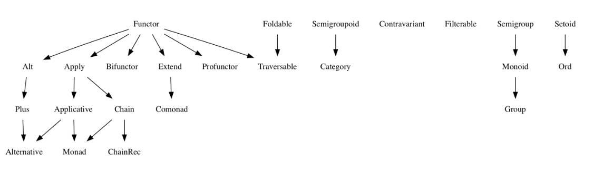
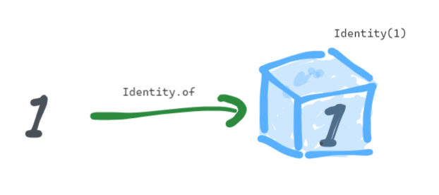
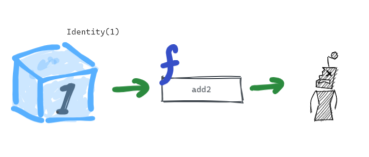
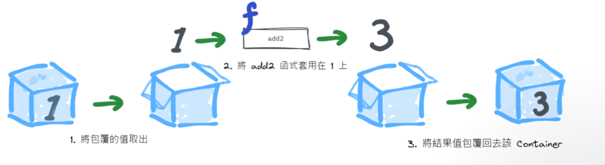

# FP Overview



### type signature briefing
```
equals :: Setoid a => a ~> a -> Boolean
```
> 整句就是若 a 是 Setoid 且有 equals 這個 method 在內， 則 a -> a -> Boolean 成立

---
# Summary

|  f   | g  | composition | desc |
|  ----  | ----  | ----  | ----  |
| pure  | pure | compose(f,g) | 兩個pure function 的 composition |
| effects  | pure(unary) | functor | f.map(g) 把一個effect跟只有一個input 的 pure function 連起來 |
| effects  | pure(n-ary) | apply | 把多個effects 與 一個有多個inputs的 pure function 連在一起 |

---

# Type Signature

### Identity
```
Identity :: a -> Identity a
```

### Functor (map)
```
map :: Functor f => f a ~> (a -> b) -> f b
```

### Apply (parallel)
```
ap :: Apply f => f a ~> f (a -> b) -> f b
```
### Chain (flatMap)
```
chain :: Chain m => m a ~> (a -> m b) -> m b
```
---
# Identity

```
Identity :: a -> Identity a
```


> Identity 就是把值封裝在container中


> 封裝後的值, 無法直接使用


---



> functor 知道如何將封裝的值進行運算, 在本例中, ***Identity(1)*** 這個 effect 與 ***add2*** 這個 pure function

--- 
### Functor Law

- Identity: u.map(x => x) === u
- Composition: u.map(f).map(g) === u.map(x => g(f(x)))

---
### Apply
```
ap :: Apply f => f a ~> f (a -> b) -> f b
                   a -> (a -> b) -> b
```
- apply a value of type a to a function of type ( a -> b ), and we get a value of b
- ap method do the same thing and wrapped in the context of ***f*** functor
- apply 可以做到 task parallel 同時執行
- f MUST be curried


```
const lift3 = g => f1 => f2 => f3 => f3.ap(f2.ap(f1.map(g)));
```
- f1, f2, f3 都是一個container, 然後apply 給 g function, 結果也會封裝在container 中
- f1, f2, f3 可以是平行的 Task, 都做完後, g function 再啓動
